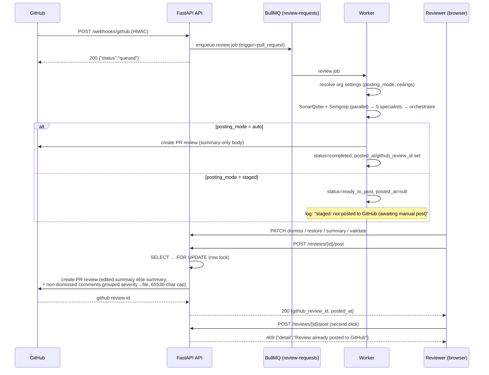

# Roles, Org Settings & Staged Reviews — Operator Guide (v0.3.0)

Companion to `docs/PLAN_ROLES_SETTINGS_STAGED.md` (Steps 1–14). This page is the
**runbook/reference** for the v0.3.0 feature set: the four-role authorization model,
per-org settings with platform ceilings, staged review posting, invitations, the
Keycloak role migration, and the cluster release procedure.

---

## 1. Role matrix

### 1.1 The ladder

| Role | Grant source (Keycloak) | Grant source (DB) | Scope |
|---|---|---|---|
| `PLATFORM_ADMIN` | group `/platform-admins` (realm role `PLATFORM_ADMIN`) | — (global-only, never in `org_members`) | platform settings, `/users`, PA bypass (below) |
| `ORG_ADMIN` | group `/org-admins` | `org_members.role` | org settings + invitations + all review writes |
| `REVIEWER` | group `/reviewers` | `org_members.role` | finding validation + all `DEVELOPER` writes |
| `DEVELOPER` | group `/developers` (or broker fallback, F1) | `org_members.role` | trigger reviews, post/dismiss/restore/summary edit |
| `NONE` | (internal sentinel — no realm role and no GitHub identity) | — | **every write → 403** (guard step 1) |

- **Global derive precedence** (`app/security/roles.py::derive_role`):
  `PLATFORM_ADMIN > NONE > ORG_ADMIN > REVIEWER > DEVELOPER`.
  An explicit legacy read-only claim (`GUEST` → `NONE`) outranks role grants —
  an explicit downgrade always wins.
- **One-release compat map** (remove in v0.4.0): `SUPER_ADMIN → PLATFORM_ADMIN`,
  `GUEST → NONE`, `DEVELOPER → DEVELOPER`. New names pass through unchanged.
- **F1 temporary fallback**: a token with *no* recognized realm role but GitHub
  identity claims derives `DEVELOPER` (structured warning; plan §6 follow-up —
  remove once every realm user has a group). Without GitHub identity → `NONE`
  (fail-closed). A token with *no role claim at all* is rejected `401` first.
- **Effective role per org endpoint** = `max(JWT role, org_members.role)`
  (`app/security/org_access.py`, `_RANK`: NONE 0, DEVELOPER 1, REVIEWER 2,
  ORG_ADMIN 3, PLATFORM_ADMIN 4).

### 1.2 Guard ladder (every org-scoped endpoint, in this order)

1. **`NONE` + write → `403`** — unconditionally, membership cannot rescue it.
2. **Membership** — caller must hold an `org_members` row for the resource's org,
   else **`404`** (uniform `"Organization not found"` — a cross-org caller must not
   learn the org exists). `PLATFORM_ADMIN` bypasses this step **only when the
   endpoint passes `platform_admin_bypass=True`** (reads + settings — flag F2).
   The mutating carve-outs pass `platform_admin_bypass=False`: **dismiss, restore,
   summary edit, post, validate** — a platform admin can never post to a customer's
   PR without being an org member.
3. **Effective role** — below the endpoint's required role → `403`
   (`"Insufficient permissions"`).

### 1.3 Endpoint guard table (v0.3.0 additions)

| Method + path | Guard (beyond auth) |
|---|---|
| `GET /api/v1/orgs/{org_id}/settings` | member + effective ≥ `ORG_ADMIN` (else 404/403); PA ok (bypass) |
| `PUT /api/v1/orgs/{org_id}/settings` | same |
| `GET/PUT /api/v1/platform/settings` | `PLATFORM_ADMIN` only |
| `PATCH /api/v1/reviews/{id}/summary` | member + ≥ `DEVELOPER`; unposted only |
| `PATCH /api/v1/reviews/{id}/comments/{cid}/dismiss` | member + ≥ `DEVELOPER` (no PA bypass) |
| `PATCH /api/v1/reviews/{id}/comments/{cid}/restore` | member + ≥ `DEVELOPER` (no PA bypass) |
| `POST /api/v1/reviews/{id}/post` | member + ≥ `DEVELOPER`; staged only; row lock → `409` |
| `PATCH /api/v1/reviews/{id}/comments/{cid}/validate` | member + ≥ `REVIEWER` (no PA bypass) |
| `POST /api/v1/orgs/{org_id}/invitations` | member + ≥ `ORG_ADMIN`; role ∈ {`DEVELOPER`,`REVIEWER`}; 20/h/org |
| `GET /api/v1/orgs/{org_id}/invitations` | member + ≥ `ORG_ADMIN` (PA ok) |
| `DELETE /api/v1/orgs/{org_id}/invitations/{inv_id}` | member + ≥ `ORG_ADMIN` (cross-org 404) |
| `GET /api/v1/invitations/{token}` | **public** (route-inventory allow-list); uniform `404` |
| `POST /api/v1/invitations/{token}/accept` | authenticated (any role incl. `NONE`) |
| review/PR routes (F3 retrofit) | member of the review's org → else `404` (PA bypass on reads) |

`GET /api/v1/users` stays `require_super_admin` — **an `ORG_ADMIN` receives `403`**
(verified live in the v0.3.0 smoke).

---

## 2. Settings model (defaults + ceilings + hard caps)

**Merge chain per field, strongest first:** `org override → platform default →
config/code default`. Numeric fields are additionally **clamped to the platform
ceiling on read** (defense in depth — even a hand-edited org row above its ceiling
serves the ceiling). Ceilings themselves can never exceed the code `HARD_CAPS`.

| Field | Config/code default | Platform ceiling (initial) | Hard cap in code (unraisable) |
|---|---|---|---|
| `diff_char_cap` | 16000 (`LLM_DIFF_CHAR_CAP`) | 100000 | 100000 (`DIFF_MAX_CHARS`) |
| `max_findings_per_agent` | 15 | 50 | 100 |
| `max_concurrent_reviews` | 5 (`BULLMQ_CONURRENCY`) | 10 | 50 |
| `enabled_agents` | `["security","complexity","performance","style","test_coverage"]` | — (names validated vs `AGENT_DOMAINS`; unknown → 422; `[]` = summary-only) | — |
| `sonarqube_enabled` / `semgrep_enabled` | `true` / `SEMGREP_ENABLED` | — | — |
| `review_triggers` | `["pull_request","manual"]` | — (enum) | — |
| `min_severity_to_post` | `info` | — (enum `info\|low\|medium\|high\|critical`) | — |
| `posting_mode` | `auto` | — (enum `auto\|staged`) | — |
| `ai_model` | `null` (system default) | — (non-empty string) | — |

Storage: `platform_settings` (exactly one row; `ceiling_*` columns seeded as above;
nullable value columns = "fall back to config default") and `org_settings`
(one row per org; all columns nullable = override absent).

**API semantics**

- `GET /orgs/{id}/settings` → stored overrides + effective values + ceilings +
  per-field `overridden` flags (member, ≥ `ORG_ADMIN`).
- `PUT /orgs/{id}/settings` — partial body: **absent field = keep, explicit
  `null` = reset**. Ceiling/vocabulary violations are rejected **422 before any
  write**.
- `GET/PUT /platform/settings` — `PLATFORM_ADMIN` only; ceilings cannot exceed
  the hard caps (422).
- **Audit = structured log** (no audit table): `logger.info` with actor id/login,
  org id and per-field `{old, new}` — no secrets.

**Worker application (Step 4)** — resolved once per job via
`resolve_org_settings(org_id)` (structured log, no secrets): diff cap clamps the
prompt; `max_findings_per_agent` limits `format_findings`; `enabled_agents` filters
the specialist list (orchestrator summary always runs); scanner flags skip
SonarQube/Semgrep (fault isolation unchanged); trigger gate (disabled → job
`{"skipped": "trigger disabled"}`, review completes with a note, not `failed`);
per-org Redis semaphore `codesage:org:{id}:active_reviews` enforces
`max_concurrent_reviews`; `min_severity_to_post` maps comment severity to the scan
vocabulary (`error→high`, `warning→medium`, `suggestion→low`, `info→info`) —
**auto mode**: no finding meets the threshold → skip the GitHub post entirely
(review completes, `github_review_id` null); **staged mode**: filters the Findings
section only (an explicit human "Post" always posts). Default `info` keeps the auto
path byte-identical to pre-v0.3.0.

---

## 3. Staged review flow



- **Body (Q3)**: summary (`edited_summary` if set) + non-dismissed comments
  grouped severity → file; sanitized LLM/scanner text; 65,536-char GitHub cap.
  `auto` posts summary-only, byte-identical to the previous release.
- **Badge**: the UI shows *posted* when `posted_at` is set; editing/dismiss/
  validate are only available while `status == ready_to_post && posted_at == null`.
- **Failure semantics**: GitHub post failure → `502` with `error_message` stored →
  retryable (the row lock makes retry/double-click safe).

---

## 4. Invitation flow

```mermaid
sequenceDiagram
    participant OA as Org admin (browser)
    participant API as FastAPI API
    participant M as MailSender (console default)
    participant IN as Invitee (browser)
    participant KC as Keycloak

    OA->>API: POST /orgs/{id}/invitations {email, role}
    Note over API: role ∈ {DEVELOPER, REVIEWER} (422 otherwise)<br/>Redis sliding window 20/hour/org → 429<br/>token = secrets.token_urlsafe(32), store SHA-256 hex ONLY
    API->>M: send {FRONTEND_URL}/invite/accept?token=…
    Note over M: MAIL_BACKEND=console (default): link appears in the<br/>backend pod log line "mail_console to=…"<br/>MAIL_BACKEND=smtp later (SMTP_* env, not present today)
    API-->>OA: 201 {id, email, role, status=pending, expires_at = now+7d}
    IN->>API: GET /invitations/{token}   (public)
    API-->>IN: 200 {org_name, role, email_masked: "st***@example.com"}<br/>unknown/expired-style token → uniform 404 "Invitation not found"
    IN->>KC: login (PKCE; logged out → auth.login(returnUrl), never auto-accept)
    IN->>API: POST /invitations/{token}/accept
    API->>API: row lock (FOR UPDATE): used → 409, expired/revoked → 410
    API->>API: UPDATE … WHERE status='pending' (rowcount 0 → 409 single-use)
    API->>API: membership upsert — never downgrades an existing role
    API-->>IN: 200 {org, role, email_mismatch}
    Note over IN: email mismatch (client-side masked compare) →<br/>offer switchAccount(returnUrl); token never logged or in console
```

- Re-inviting an existing `ORG_ADMIN` with role `DEVELOPER` **keeps** `ORG_ADMIN`
  (never-downgrade upsert, verified live).
- Revoke: `DELETE /orgs/{id}/invitations/{inv_id}` → `204` (any later accept → `410`).
- Rate limit fails **open** only if Redis itself is down (logged); otherwise 429
  with `"Invitation rate limit reached (20 per hour per org)."`.

---

## 5. Keycloak role migration (`scripts/keycloak_migrate_roles.sh`)

Migrates the **live realm** — never re-imports or wipes it (the realm ConfigMap is
for fresh installs only).

```bash
scripts/keycloak_migrate_roles.sh --dry-run   # print the plan, change nothing
scripts/keycloak_migrate_roles.sh --yes        # apply (asks for confirmation)
```

What it does (**idempotent, additive only** — never deletes a realm role/group):

1. creates realm roles `PLATFORM_ADMIN` / `ORG_ADMIN` / `REVIEWER` if missing
   (legacy `SUPER_ADMIN` / `DEVELOPER` / `GUEST` are left alone);
2. creates groups `/platform-admins`, `/org-admins`, `/reviewers` (and
   `/developers` when absent) and binds each to its realm role;
3. moves members: `SUPER_ADMIN` holders → `/platform-admins` (new group joined
   **before** leaving `/super-admins` — a user is never left without an admin
   claim); `DEVELOPER` holders → `/developers` when in no group yet;
4. does **not** touch `GUEST` members (F4/N5): they are **listed** for manual
   assignment, as are users with no recognized realm role (they derive `NONE` or
   hit the F1 broker fallback) — both lists print in dry-run **and** apply;
5. runs `kcadm.sh` inside the keycloak pod (admin creds from
   `secret/keycloak-secret`; master realm) and parses JSON on the host with
   `python3`.

**Keycloak 24 kcadm quirks the script works around** (learned during v0.3.0):

| Quirk | Wrong (404/silent) | Correct |
|---|---|---|
| group realm-role bind path | `groups/{id}/realm-role-mappings/realm` | **`groups/{id}/role-mappings/realm`** |
| `kc create groups` id | goes to **stderr** (`Created new group with id '…'`) | create silently, resolve id from a fresh `GET groups` by path |
| add user to group | `POST users/{uid}/groups/{gid}` (404) | **`PUT` / `kc update users/{uid}/groups/{gid}`** (idempotent) |
| remove user from group | `kc remove …` (no such command) | `kc delete users/{uid}/groups/{gid}` |

Each `kcadm` call spawns a JVM (~2–4 s) — a full run takes minutes.

---

## 6. TAG rebuild / deploy runbook (local k3s)

> Host constraint: **no passwordless sudo** — kubelet pulls pinned tags through
> `/etc/rancher/k3s/registries.yaml` → `127.0.0.1:5000` (keep the `local-registry`
> docker container running: `docker start local-registry`).

```bash
export TAG=v0.3.0            # never :latest
TAG=$TAG infrastructure/k8s/scripts/build-and-deploy.sh
                            # builds+pushes backend, worker, semgrep-service,
                            # frontend at 127.0.0.1:5000/codesage/<svc>:$TAG
curl -s http://127.0.0.1:5000/v2/codesage/backend/tags/list   # must show $TAG
kubectl diff -n codesage -f infrastructure/k8s/base   # SHOW FIRST — must not
                            # touch postgres/redis/keycloak/PVCs
```

**Migrations** — `infrastructure/k8s/APPLY_ORDER.md` still shows a
`kubectl run … --env-from` one-shot, but **kubectl v1.36 removed `--env-from`**.
Use an explicit Pod manifest (what was used for v0.3.0):

```yaml
apiVersion: v1
kind: Pod
metadata: { name: alembic-migrate, namespace: codesage }
spec:
  restartPolicy: Never
  containers:
    - name: alembic
      image: 127.0.0.1:5000/codesage/backend:$TAG   # expanded literally
      imagePullPolicy: IfNotPresent
      command: ["alembic", "upgrade", "head"]
      envFrom: [{ secretRef: { name: codesage-backend-secret } }]
```

```bash
kubectl apply -f alembic-pod.yaml && kubectl logs -f -n codesage alembic-migrate
kubectl exec -n codesage deploy/postgres -- psql -U codesage -d codesage \
  -tAc "select version_num from alembic_version"          # expect head (018)
```

**Seeds & realm** (both gates shown before apply):

```bash
( cd backend && ./venv/bin/python ../scripts/org_seed_report.py )        # dry-run
scripts/keycloak_migrate_roles.sh --dry-run                              # then --yes
```

```bash
kubectl rollout status deploy/codesage-backend -n codesage --timeout=300s
kubectl rollout status deploy/codesage-worker  -n codesage --timeout=300s
```

**Same-tag rebuild gotcha** — with `imagePullPolicy: IfNotPresent` kubelet will
**not** re-pull `$TAG` it already has in containerd, and without sudo you cannot
`k3s ctr images rm` on the host. Evict the stale refs from a pod that mounts the
containerd socket (the container must run as **uid 0** — the app image's default
`appuser` gets `permission denied`; `chroot /host`/`nsenter` from `kubectl debug`
are `EPERM` on the current kernel):

```yaml
apiVersion: v1
kind: Pod
metadata: { name: ctr-evict, namespace: default }
spec:
  restartPolicy: Never
  containers:
    - name: ctr
      image: 127.0.0.1:5000/codesage/backend:$TAG
      imagePullPolicy: IfNotPresent
      securityContext: { runAsUser: 0 }
      command: ["/bin/sh", "-c",
        "/usr/local/bin/k3s-host ctr images rm 127.0.0.1:5000/codesage/backend:$TAG &&
         /usr/local/bin/k3s-host ctr images rm 127.0.0.1:5000/codesage/worker:$TAG"]
      volumeMounts:
        - { name: sock, mountPath: /run/k3s/containerd/containerd.sock }
        - { name: k3s,  mountPath: /usr/local/bin/k3s-host }
  volumes:
    - name: sock
      hostPath: { path: /run/k3s/containerd/containerd.sock, type: Socket }
    - name: k3s
      hostPath: { path: /usr/local/bin/k3s, type: File }
```

```bash
kubectl apply -f ctr-evict.yaml && kubectl logs -f ctr-evict   # "… evicted"
kubectl rollout restart deploy/codesage-backend deploy/codesage-worker -n codesage
```

**Smoke checklist** (API base = ingress IP, `kubectl get ingress -n codesage`):

| Check | Expect |
|---|---|
| `GET /api/v1/health` | `{"status":"healthy"}` |
| `GET /api/v1/health/ready` | `checks.database: true` |
| `GET /api/v1/orgs` unauth | `401` |
| `GET /api/v1/invitations/bogus` | uniform `404 Invitation not found` |
| `GET /api/v1/users` as ORG_ADMIN | `403` |
| cross-org `GET/PUT /orgs/{other}/settings` | uniform `404` |
| invite → accept → re-accept | `201 → 200 (role not downgraded) → 409` |
| org `posting_mode=staged` + trigger | worker stops at `ready_to_post`, `posted_at` null |
| `POST /reviews/{id}/post` ×2 | `200 github_review_id → 409` |

Route inventory: `ENABLE_API_DOCS=true` serves the spec at `/api/openapi.json`
(cluster runs with docs disabled — `ENABLE_API_DOCS` unset/false), or run the
pytest route-inventory test.

---

## 7. v0.3.0 release verification (2026-10-05, local k3s)

| Gate / check | Result | Evidence |
|---|---|---|
| `kubectl diff` before apply | ✅ only 3 image bumps + realm ConfigMap (no postgres/redis/PVC) | shown pre-apply |
| Alembic `011 → 018` (one-shot pod) | ✅ migration logs shown, `alembic_version=018` | pod `alembic-migrate-v030b` logs |
| `org_seed_report.py` dry-run | ✅ 1 org / 1 member / 0 warnings (no `--apply` needed) | run output |
| `keycloak_migrate_roles.sh --dry-run` then apply | ✅ `Done.` rc=0; roles+groups created; `superadmin` in `/platform-admins` only; F1 user untouched | run output |
| images at `$TAG`, `IfNotPresent`, no `:latest` | ✅ registry tags list + running digests match pushed digests | `/v2/…/tags/list`, pod `imageID` |
| 4-role access matrix (401/403/404 incl. cross-org) | ✅ | §6 smoke table |
| org override changes worker behavior | ✅ `posting_mode=staged` → `ready_to_post`, worker log `"staged: not posted"` | backend/worker logs |
| staged not posted until Post; double-post 409 | ✅ GitHub review `5410270198` posted once, second → `409` | API responses |
| dismiss/restore/validate + scan report | ✅ 200s; one validation row (upsert replaced verdict); 68 findings | API + psql |
| invite flow incl. re-invite no-downgrade | ✅ console link → masked preview → accept keeps `ORG_ADMIN` → re-accept `409` | API + logs |
| release-fix regressions | ✅ `pytest 415 passed / 5 skipped`; ruff/black/bandit clean on touched files; mypy unchanged | local run |

**Migrations in this release:** `012` four-role vocab · `013` orgs + seed ·
`014` staged columns · `015` comment enrichment (`source_domain`) ·
`016` finding validations · `017` invitations · `018` `org_invitations.updated_at`
(hotfix: 017 omitted the `Base` timestamp — tests use `create_all`, so only a
migrated DB caught it).
