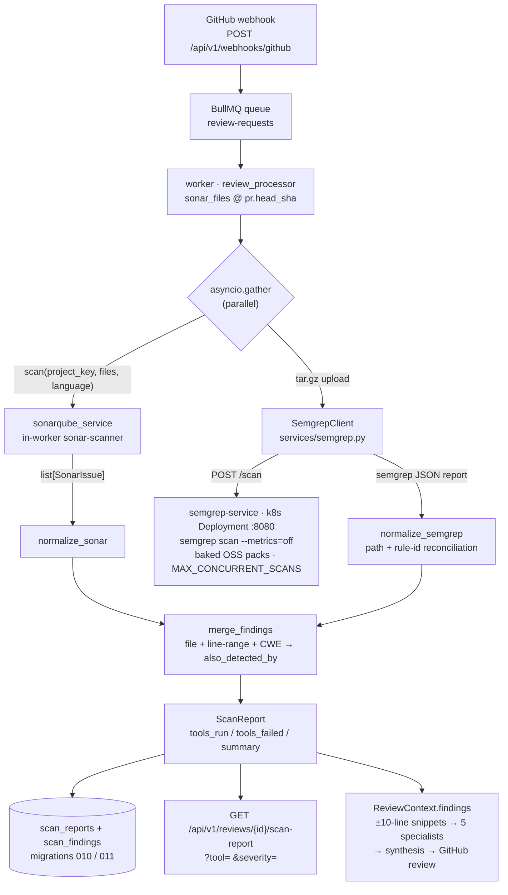

# Semgrep Integration — Architecture & Operations

CodeSage runs **Semgrep OSS alongside SonarQube** on every review: two
analyzers over the *same* file workspace, one unified cross-merged finding
list fed to the review agents. Semgrep runs in its own always-on HTTP
service — no account, no token, `--metrics=off` always, OSS rule packs
baked into the image at build time.

- Plan and step→commit log: [`SEMGREP_INTEGRATION_PLAN.md`](SEMGREP_INTEGRATION_PLAN.md)
- Service internals (endpoints, limits, extractor guards): [`services/semgrep-service/README.md`](../services/semgrep-service/README.md)

## Architecture



### Design points

- **Identical input.** The worker packs the exact `sonar_files` workspace
  (full file contents fetched at `pr.head_sha`) into a `tar.gz` and
  uploads it — both analyzers scan the same bytes at the same ref, which
  is what makes cross-tool dedup meaningful. No git clone, no shared PVC,
  no GitHub credentials in the scanner service.
- **Stateless service.** Fresh temp dir per request; hardened extractor
  rejects traversal / link / device members and size caps (413);
  `MAX_CONCURRENT_SCANS` bounds processes and temp-disk use.
- **Fault isolation (hard constraint).** A Semgrep or SonarQube
  failure/timeout lands in `tools_failed` + a note in
  `reviews.error_message` and degrades to the surviving tool (or empty
  findings) — the review itself never fails.
  `SEMGREP_ENABLED=false` removes Semgrep from the run entirely
  (disabled ≠ broken).
- **Path & rule-id contract.** The service returns paths as semgrep saw
  them — absolute inside its per-request temp dir
  (`/tmp/semgrep-scan-…/src/src/app.py`) — and a `check_id` prefixed with
  the full `--config` path flattened to dots
  (`opt.semgrep-rules.python.lang…`). The backend normalizer reconciles
  both onto the workspace's own names (`src/app.py`, `python.lang…`)
  because snippet enrichment, the cross-tool merge, and SonarQube's
  component paths all key on those. Tolerant either way: if the service
  ever returns workspace-relative paths, the reconciliation is a no-op.

## Environment variables

### Backend / worker (client side)

| Env | Default | Meaning |
|---|---|---|
| `SEMGREP_ENABLED` | `true` | Master switch — `false` = SonarQube-only scans |
| `SEMGREP_SERVICE_URL` | `http://semgrep-service:8080` | In-cluster base URL |
| `SEMGREP_TIMEOUT_SECONDS` | `60` | Client HTTP budget for one `POST /scan` |
| `SEMGREP_MAX_UPLOAD_BYTES` | `5242880` (5 MiB) | Pre-flight cap on the tar.gz |

Defaults live in `backend/app/config.py`. In the cluster all four come
from ConfigMap **`semgrep-config`** (`envFrom` on the backend API *and*
the worker deployments); locally set them in `backend/.env`.

### Semgrep service side

| Env | Default | Meaning |
|---|---|---|
| `MAX_CONCURRENT_SCANS` | `2` | Concurrent scan processes |
| `MAX_UPLOAD_BYTES` / `MAX_EXTRACTED_BYTES` / `MAX_EXTRACTED_FILES` | 5 MiB / 64 MiB / 5000 | Extraction guards (→ 413) |
| `SEMGREP_BINARY` / `SEMGREP_RULES_DIR` | `semgrep` / `/opt/semgrep-rules` | CLI + baked packs |
| `SEMGREP_TIMEOUT_SECONDS` / `MAX_SCAN_TIMEOUT_SECONDS` / `KILL_GRACE_SECONDS` | `60` / `600` / `30` | Per-request budget, ceiling, hard-kill grace |

In the cluster these also come from ConfigMap `semgrep-config`
(`infrastructure/k8s/base/semgrep-service/configmap.yaml`). Status codes
for `/scan` (`400/413/422/502/504`) are documented in the service README.

## Rebuild & deploy

```bash
# Full release: build + push/import the 3 pinned images, apply the base,
# restart + wait for all five deployments:
bash infrastructure/k8s/scripts/build-and-deploy.sh

# With a new tag (manifests follow the TAG variable):
TAG=v0.3.0-semgrep bash infrastructure/k8s/scripts/build-and-deploy.sh

# Only the scanner service changed:
docker build -t 127.0.0.1:5000/codesage/semgrep-service:$TAG \
  -f services/semgrep-service/Dockerfile ./services/semgrep-service
kubectl apply -k infrastructure/k8s/base/semgrep-service/
kubectl rollout restart deployment/semgrep-service -n codesage
```

Notes:

- **Tags** are pinned (`TAG=v0.2.0-semgrep` default), never `:latest`,
  `imagePullPolicy: IfNotPresent`, image refs
  `127.0.0.1:5000/codesage/{backend,worker,semgrep-service}:$TAG`.
- The script pushes to the `local-registry` container (`docker start
  local-registry` if it's down) and imports into k3s containerd — unless
  `/etc/rancher/k3s/registries.yaml` exists, in which case kubelet pulls
  from the registry directly and the (root-needing) import is skipped.
- **The release apply deliberately excludes the one-shot
  `keycloak-db-init` Job** (TTL-deleted after completion; re-applying the
  base would re-run its SQL on every release). First-time cluster
  bootstrap only:
  `kubectl apply -f infrastructure/k8s/base/keycloak/keycloak-db-init.yaml`
- **Same-tag rebuild caveat.** With `IfNotPresent` and an *unchanged*
  tag, kubelet keeps using the containerd-cached image. After rebuilding
  under the same tag, either bump `TAG` (preferred) or evict the cached
  refs, then restart:
  `sudo k3s ctr images rm 127.0.0.1:5000/codesage/semgrep-service:v0.2.0-semgrep`
  (+ the backend/worker refs) → `kubectl rollout restart deployment/... -n codesage`.
- **Fresh cluster order:** `base/semgrep-service/` (owns ConfigMap
  `semgrep-config`) must be applied *before* the backend/worker
  deployments that `envFrom` it — see `infrastructure/k8s/APPLY_ORDER.md`
  Step 7b.

## Rule updates

Rules are baked in the image's first stage: `https://semgrep.dev/c/p/default`
and `/p/security-audit` are downloaded at build time and **verified
against sha256 pins** (`P_DEFAULT_SHA256`, `P_SECURITY_AUDIT_SHA256` ARGs).
If upstream changes pack content, the build fails at `sha256sum -c`
instead of silently scanning different rules.

Refresh deliberately: fetch + `sha256sum` the packs, bump the ARG
defaults in `services/semgrep-service/Dockerfile` (or pass
`--build-arg`), rebuild and redeploy the service image (exact commands:
service README → "Updating the baked rules").

## Smoke test

```bash
scripts/smoke_semgrep.sh
```

Phases: (1) in-cluster connectivity `worker → semgrep-service:8080/readyz`,
(2) local `kubectl port-forward` (reuses an existing healthy listener),
(3) a real tar.gz scan through `POST /scan`, (4) the E2E pytest suite
`backend/tests/e2e/` — connectivity, live-scan normalization onto the
workspace, **parallel-timing evidence** (overlapping sonar/semgrep
intervals + elapsed < sum of durations) against the real ~40 s scan, and
failure modes (dead endpoint fails soft; garbage upload → immediate
`HTTP 400`).

- `SMOKE_SKIP_PYTEST=1` runs only phases 1–3; `SMOKE_NAMESPACE` /
  `SMOKE_PORT` override namespace and local port.
- The E2E tests are opt-in: skipped unless `SEMGREP_E2E_URL` is set, so
  plain `pytest -q` stays green. They are DB-free (the module-scoped
  `_clean_state` shadow in `tests/e2e/test_semgrep_e2e.py` replaces the
  suite's Postgres/Redis cleaner) — no docker-compose database needed.

## Troubleshooting

| Symptom | Likely cause | Fix |
|---|---|---|
| `/readyz` → 503 | semgrep binary or baked rules missing in the pod | `kubectl logs deploy/semgrep-service -n codesage`; usually a failed image build (rules stage / sha pin) |
| Review note says `Semgrep scan failed: … unreachable after N attempt(s)` | service down or in-cluster DNS | `kubectl get svc -n codesage semgrep-service`; in-cluster check: `kubectl -n codesage exec deploy/codesage-worker -- wget -q -T5 -O- http://semgrep-service:8080/readyz`; locally: `kubectl -n codesage port-forward svc/semgrep-service 18080:8080` then `curl localhost:18080/readyz` |
| Review completed but `tools_failed: ["semgrep"]` | fault isolation worked as designed — the review still posted | `kubectl logs deploy/codesage-worker -n codesage \| grep -i semgrep` for the timeout/HTTP cause |
| Scans slow or timing out | rule-pack load ≈ 40 s (1087 rules), dominates every scan; default 60 s budget fits but is tight for big inputs | raise `SEMGREP_TIMEOUT_SECONDS` (both sides, ConfigMap `semgrep-config`) and, if needed, the service's `MAX_SCAN_TIMEOUT_SECONDS`; the client aborts at `timeout + 40 s` grace |
| Findings not merged / no snippet context (regression) | path reconciliation broken | `scripts/smoke_semgrep.sh` reproduces it live (`test_scan_output_lands_on_the_workspace`, `test_full_pipeline_runs_tools_in_parallel_and_merges`) |
| E2E tests skipped in a normal `pytest -q` run | expected — `SEMGREP_E2E_URL` unset | run `scripts/smoke_semgrep.sh` (or export `SEMGREP_E2E_URL` against a port-forward) |
| `POST /scan` returns 400 / 413 / 422 / 502 / 504 | invalid/unsafe archive · size caps · no files or bad `languages` · semgrep failure · hard timeout | detail is in the response body; semgrep-side logs: `kubectl logs deploy/semgrep-service -n codesage` (full table in the service README) |
| Rebuilt image has no effect | same tag + `IfNotPresent` → cached ref wins | bump `TAG` (manifests follow) or evict with `sudo k3s ctr images rm <ref>` + `kubectl rollout restart deployment/<name> -n codesage` |
| Semgrep never runs, only SonarQube | `SEMGREP_ENABLED: "false"` | deliberate switch in ConfigMap `semgrep-config`, not a fault |

## File map

| Path | Role |
|---|---|
| `services/semgrep-service/` | scanner service: FastAPI app, hardened extractor, CLI runner, Dockerfile (baked rules), tests, README |
| `backend/app/services/semgrep.py` | `SemgrepClient` (upload, retries/backoff) + `build_scan_archive` |
| `backend/app/services/normalizers/` | `schema.py` (`NormalizedFinding`, `ScanReport`), `sonarqube.py`, `semgrep.py`, `merge.py`, `snippets.py` |
| `backend/app/services/static_analysis.py` | parallel gather, report assembly, fault isolation |
| `backend/app/db/models/scan_reports.py` | `scan_reports` + `scan_findings` (migrations `010`, `011`) |
| `backend/app/api/routes/reviews.py` | `GET /api/v1/reviews/{review_id}/scan-report` |
| `infrastructure/k8s/base/semgrep-service/` | Deployment + ClusterIP Service + ConfigMap `semgrep-config` |
| `scripts/smoke_semgrep.sh` | end-to-end smoke (connectivity, live scan, E2E suite) |
| `backend/tests/e2e/test_semgrep_e2e.py` | opt-in E2E suite (gated on `SEMGREP_E2E_URL`) |
